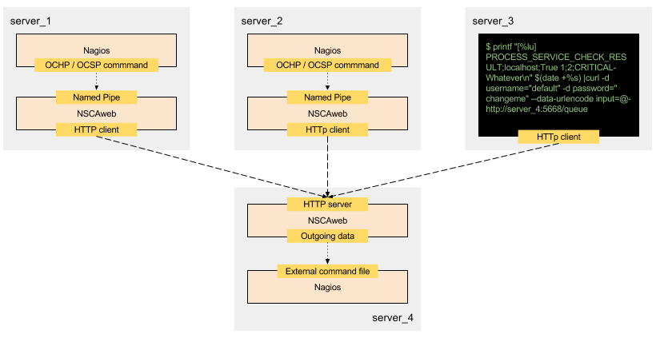

.. caution::

    NSCAweb has been abandoned.
    It will not be further developed.
    Bug reports and pull requests will not be followed up on.

NSCAweb
=======

What?
-----

NSCAweb is a Nagios core based monitoring solution addon which allows you to
easily submit (passive) host and service checks over http(s) to the Nagios
external command file. It aims to be a better,more feature rich alternative
than the classic NSCA daemon.

NSCAweb has following features:

- http(s) as transport makes it more friendly in a firewalled environment.
- SSL encryption when desired.
- Supports multiline plugin & performance output.
- Accepts data coming over http or from local named pipes.
- Submit data to many types of destinations: named pipes (nagios.cmd), NSCAweb, NRDP or a file.
- Loadbalance and failover between multiple urls per destination.
- Duplicate and forward passive check results to an "unlimited" amount of destinations.
- Submit messages to 1 destination or all destinations depending on the url messages are send to.
- Simultaneous local and remote delivery.
- Each destination has an independent, dedicated thread and queue.
- Buffering of unavailable destinations and resubmitting when destination comes available to prevent data loss.
- Builtin, multiuser authentication.
- Trivial to submit check results using http post.
- Submit check results in bulk or one by one.
- Use curl as a client from the command line.

Support
-------

Post a message in Google groups: https://groups.google.com/forum/#!forum/nscaweb

Submit bugreports to: https://github.com/smetj/nscaweb/issues

Installation
------------

You can install NSCAweb from https://pypi.python.org/pypi by executing:

    | $ easy_install nscaweb

Or you can install NSCAweb directly from source when desired:

    | $ git clone https://github.com/smetj/nscaweb.git
    | $ cd nscaweb
    | $ sudo python setup.py install

Any Python related dependencies should be resolved and installed
automatically.

Usage
-----

After installing the package you should have the `nscaweb` command available.

Starting in foreground.  Press ctrl+c to exit:

    $ nscaweb debug --config /etc/nscaweb.conf

Starting in background.

    $ nscaweb start --config /etc/nscaweb.conf

Stop a background process:

    $ nscaweb stop --config /etc/nscaweb.conf

Configuration
-------------

The configuration file is in ini style and has 4 sections:

application
~~~~~~~~~~~

The application section controls the behaviour of the daemon itself.

.. code-block:: ini

    [ "application" ]
        host                = "0.0.0.0"
        port                = "5668"
        pidfile             = "/opt/nscaweb/var/nscaweb.pid"
        sslengine           = "off"
        sslcertificate      = ""
        sslprivatekey       = ""
        queue_quota         = "104857600"

*   host

    The IP address NSCAweb should bind to and listen on. By default NSCAweb
    listens on all interfaces it can find on the machine. This behavior is
    reached by using the "0.0.0.0" which effectively means listen on all
    interfaces. If you want to have NSCAweb to listen on a certain ip address,
    then you can define it here. If you want NSCAweb only to listen on the
    localhost you can define "127.0.0.1".

*   port

    The port on which NSCAweb should listen. By default NSCAweb listens on port
    12345. It can be changed to what makes most sense to your environment.

*   pidfile

    The location of the pidfile. The pidfile holds the process number of the
    NSCAweb daemon when it has been started in background mode. It's not created
    when NSCAweb is started in debug mode. The pidfile is used by NSCAweb itself
    for server control. Do not delete this file while NSCAweb is running in
    background mode.

*   sslengine

    Makes NSCAweb listen to https instead of standard http and encrypt all
    traffic. The allowed values are "on" and "off". If you have defined on you
    need to define the sslcertificate and the sslprivatekey parameters. If you
    choose off, the sslcertificate and sslprivatekey parameters are ignored.

*   sslcertificate

    Defines the place of the sslcertificate. You can create and use self-signed
    certificates or an official one. You can basically follow any Apache/ssl
    certificate creation guide to create one.

*   sslprivatekey

    Defines the place of the ssl private key. When you're in the process of
    creating your certificate you will also have your private key. This is a quite
    sensitive piece of information. Make sure it's on a safe place.

*   queue_quota

    The value in bytes a queue is allowed to contain before refusing data.

logging
~~~~~~~

Logging related options

.. code-block:: ini

    [ "logging" ]
        logfile             = "/var/log/nagios/nscaweb.log"
        enable_syslog       = "1"
        enable_http_logging = "0"

*   logfile

    The location of the logfile.  If commented, no logfile is created.

*   enable_syslog

    If enabled, writes logs to syslog.

*   enable_http_logging

    If enabled, includes any http request related logging to the log destination.

pipes
~~~~~

NSCAweb can accept data over named pipe.

.. code-block:: ini

    [ "pipes" ]
        enable          = "1"
        directory       = "/var/tmp/"

*   enable

    When enabled, creates the named pipes.

*   directory

    The location of the named pipes.

For each defined destination a corresponding named pipe is created.
Submitting data to a named pipe results in that data being send to the
corresponding destination. A special "broadcast" named pipe is also created
which submits incoming data to all defined destinations.

destinations
~~~~~~~~~~~~

A destination is an entry point into NCSAweb and data submitted into it leads
to the type and location associated with it.
Multiple NSCAweb destinations can be defined.
Each destination should have a unique name.  The name identifies the
destination when submitting data.  A destination name is free to choose.

4 different destination types are available:

*   local
    Writes data to a local named pipe.

*   nscaweb
    Writes data to another NSCAweb instance.

*   nrdp
    Writes data to a NRDP receiver

*   file
    Writes data into a file

.. code-block:: ini

    [ "destinations" ]

        [[ "local" ]]
            enable      = "0"
            type        = "local"
            locations   = "/opt/nagios/var/rw/nagios.cmd"

        [[ "master" ]]
            enable      = "0"
            type        = "nscaweb"
            locations   = "http://server_23.company.local:15668/queue/local"
            username    = "default"
            password    = "changeme"

        [[ "nagiosWithNrdp" ]]
            enable      = "0"
            type        = "nrdp"
            locations   = "http://nagios/nrdp/"
            username    = "default"
            password    = "changeme"
            token       = "mysecrettoken"

        [[ "debugging" ]]
            enable      = "0"
            type        = "file"
            locations   = "/tmp/external_commands.log"

Destination types
#################

local
*****

*   locations

    A comma delimited list of named pipe locations.

nscaweb
*******

*   locations

    A comma delimited list of urls

*   username

    The username to authenticate to the remote NSCAweb instance

*   password

    The password to authenticate to the remote NSCAweb instance

nrdp
****

*   locations

    A comma delimited list of urls.

*   username

    The username to authenticate to the remote NRDP instance

*   password

    The password to authenticate to the remote NRDP instance

*   token

    The token used to authenticate to the remote NRDP instance

authentication
~~~~~~~~~~~~~~

The authentication section contains the usernames and passwords used to
authenticate to NSCAweb in order to dump data.

.. code-block:: ini

    [ "authentication" ]
            default         = "6ac371cc3dc9d38cf33e5c146617df75"

This contains a list of username and corresponding password hashes. In this
case there's only 1 user defined with the login name "default" and password
"changeme".

The password is a md5sum.  To generate a hash value out of a string you can
execute the following:

    $ echo changeme|md5sum

**Warning**: Each NSCAweb installation comes with the default username "default"
and password "changeme". CHANGE IT!.

NSCAweb transport scenario's
----------------------------

A typical NSCAweb setup looks like this:

From command line to NSCAweb
~~~~~~~~~~~~~~~~~~~~~~~~~~~~

Sometimes you have to submit a check result (or other command) into Nagios
from a remote host.  You can do that by simply using curl or wget from command
line.  In the above diagram, we have server_3 sending check updates to
server_4.  Server_4 then writes the incoming check results into the Nagios
external command pipe.

Following example command does that:

    printf "[%lu] PROCESS_SERVICE_CHECK_RESULT;localhost;True 1;2;CRITICAL- Whatever\n" $(date +%s) | \
    curl -d username="default" -d password="changeme" --data-urlencode input=@- http://localhost:5668/queue

When posting data to the NSCAweb webserver you have to keep 3 fields into
account:

* username
* password
* input

The input field should contain 1 or more entries with the same syntax as
described below. When you use multiple lines as plugin output then use "\\\n"
to separate those multiple lines. NSCAweb considers each *newline* as a new
command.

**Note**: Keep in mind that all data you send to NSCAweb needs to be URL
encoded. Submit 1 check result to NSCAweb using curl.

**Note**: Make sure to use a version of curl which supports the '--data-
urlencode' parameter.

**Note**: Make sure that newlines in multiline output are replaced by litteral
"\n" prior to sending over to NSCAweb.

From NSCAweb to NSCAweb
~~~~~~~~~~~~~~~~~~~~~~~

Let's say you have 2 Nagios slave machines (diagram server_1 and server_2)
which have to forward their results to a central Nagios machine (diagram
server_3) you will have to configure following items:

Install NCSAweb on all 3 servers
--------------------------------

Nagios on the saves will submit check results to a local NSCAWeb instance,
which takes care of transporting the results to the remote NSCAweb instance.

Configure OCHP and OHSP on slaves
---------------------------------

See:

- http://nagios.sourceforge.net/docs/3_0/configmain.html#ochp_command
- http://nagios.sourceforge.net/docs/3_0/configmain.html#ocsp_command

**Note**: Nagios treats everything coming after a ";" as comment.
Unfortunately we need the ";" character to compose the check result data we
want to forward. Therefor we we have to assign the ";" to a $USER<number>$
value in the `resource`_ file.  In the below example we havve assigned the ";"
value to $USER9$

::

    define command {
            command_name    submit_service_check_result_nscaweb
            command_line    echo "[$TIMET$] PROCESS_SERVICE_CHECK_RESULT$USER9$$HOSTNAME$$USER9$$SERVICEDESC$$USER9$$SERVICESTATEID$$USER9$$SERVICEOUTPUT$|$SERVICEPERFDATA$" >> /var/tmp/server_4
    }

    define command {
            command_name    submit_host_check_result_nscaweb
            command_line    echo "[$TIMET$] PROCESS_HOST_CHECK_RESULT$USER9$$HOSTNAME$$USER9$$HOSTSTATEID$$USER9$$HOSTOUTPUT$|$HOSTPERFDATA$" >> /var/tmp/server_4
    }

Configure NSCAweb on the slave (sender)
---------------------------------------

In the above example commands we submit the check results into a named pipe called /var/tmp/server_4.
Therefor we need the following section in the sending NSCAweb configuration:

 .. code-block:: ini

    [ "destinations" ]

        [[ "server_4" ]]
            enable      = "0"
            type        = "nscaweb"
            locations   = "http://server_4:15668/queue/local"
            username    = "default"
            password    = "changeme"

Configure NSCAweb on the master (receiver)
------------------------------------------

On the receiving end (server_4) we have NSCAweb writing incoming data into the
`nagios external command file`_

.. code-block:: ini

        [[ "local" ]]
            enable      = "1"
            type        = "local"
            locations   = "/usr/local/nagios/var/rw/nagios.cmd"

.. _resource: http://nagios.sourceforge.net/docs/3_0/configmain.html#resource_file
.. _nagios external command file: http://nagios.sourceforge.net/docs/3_0/extcommands.html
